# BÁO CÁO ĐỒ ÁN

## HỆ THỐNG TƯỚI CÂY THÔNG MINH SỬ DỤNG ESP32 + THINGSPEAK
### Phần: Phân tích dữ liệu & Trí tuệ nhân tạo (AI)

---

## Mục lục

1. [Giới thiệu](#1-giới-thiệu)
2. [Thu thập dữ liệu](#2-thu-thập-dữ-liệu)
3. [Tiền xử lý dữ liệu](#3-tiền-xử-lý-dữ-liệu)
4. [Phân tích dữ liệu](#4-phân-tích-dữ-liệu)
5. [Biểu đồ](#5-biểu-đồ)
6. [Thuật toán dự báo (AI)](#6-thuật-toán-dự-báo-ai)
7. [Thuật toán điều khiển](#7-thuật-toán-điều-khiển)
8. [Kết quả](#8-kết-quả)
9. [Đánh giá](#9-đánh-giá)
10. [Hướng phát triển](#10-hướng-phát-triển)

---

## 1. Giới thiệu

Hệ thống tưới cây thông minh sử dụng vi điều khiển ESP32 kết hợp nền tảng ThingSpeak
nhằm tự động hoá việc theo dõi và tưới nước cho cây trồng dựa trên dữ liệu cảm biến
thời gian thực. ESP32 thu thập 5 thông số môi trường: nhiệt độ, độ ẩm đất, độ ẩm
không khí, cường độ ánh sáng và trạng thái máy bơm, sau đó gửi dữ liệu lên ThingSpeak
Cloud thông qua giao thức HTTP.

Báo cáo này trình bày phần **Phân tích dữ liệu và Trí tuệ nhân tạo (AI)** của đồ án,
bao gồm: thu thập dữ liệu từ ThingSpeak API, làm sạch và tiền xử lý dữ liệu, phân tích
thống kê mô tả, trực quan hóa dữ liệu bằng biểu đồ, xây dựng mô hình AI dự báo nhu cầu
tưới cây (Moving Average kết hợp Linear Regression), và thiết kế thuật toán ra quyết
định điều khiển máy bơm tự động.

Mục tiêu cuối cùng là giúp hệ thống tưới cây hoạt động chủ động, tiết kiệm nước, đồng
thời cung cấp công cụ trực quan để người dùng theo dõi tình trạng cây trồng theo thời gian.

---

## 2. Thu thập dữ liệu

Dữ liệu được thu thập từ ThingSpeak Channel thông qua REST API dạng JSON, sử dụng thư
viện `requests` của Python để gửi HTTP GET request tới endpoint `feeds.json`. Mỗi bản
ghi (feed) gồm các trường: `created_at` (thời gian), `entry_id`, `field1` đến `field5`
tương ứng với nhiệt độ, độ ẩm đất, độ ẩm không khí, cường độ ánh sáng và trạng thái bơm.

Quy trình thu thập dữ liệu được thực hiện trong module `src/api.py` với các bước:

- Gửi request tới ThingSpeak API với Channel ID và Read API Key (nếu channel ở chế độ Private).
- Xử lý các lỗi phổ biến: timeout kết nối, lỗi HTTP (401, 403, 404...), dữ liệu JSON
  không hợp lệ, feeds rỗng — có cơ chế thử lại (retry) tối đa 3 lần với backoff tăng dần.
- Chuyển đổi JSON trả về thành `pandas.DataFrame`, đổi tên các cột `field1`-`field5`
  thành tên có ý nghĩa (`temperature`, `soil_moisture`, `air_humidity`, `light_intensity`, `pump_status`).
- Ép kiểu dữ liệu số (numeric) cho các cột cảm biến và chuyển `created_at` sang kiểu `datetime`.
- Loại bỏ các bản ghi hoàn toàn rỗng (không có dữ liệu cảm biến nào).

> **Đã kiểm thử:** khi chạy `src/api.py` với Channel ID/API Key giả (`YOUR_CHANNEL_ID`),
> hệ thống trả về lỗi `403 Forbidden` sau 3 lần thử, sau đó **tự động gợi ý** dùng dữ
> liệu mô phỏng — đúng như thiết kế xử lý lỗi.

Trong trường hợp chưa triển khai được phần cứng ESP32 thật hoặc chưa có channel
ThingSpeak, hệ thống sử dụng bộ sinh dữ liệu mô phỏng (`generate_simulated_data` trong
`preprocess.py`) tạo ra **500 bản ghi** có đặc tính giống dữ liệu thực tế: nhiệt độ và
ánh sáng dao động theo chu kỳ ngày/đêm, độ ẩm đất giảm dần do bốc hơi và tăng vọt khi
bơm được kích hoạt.

---

## 3. Tiền xử lý dữ liệu

Dữ liệu thô sau khi thu thập được làm sạch qua module `src/preprocess.py` với các bước xử lý:

1. Loại bỏ các dòng dữ liệu trùng lặp hoàn toàn.
2. Loại bỏ các dòng thiếu mốc thời gian (`created_at`) do không thể xác định được vị
   trí trong chuỗi thời gian.
3. Phát hiện và loại bỏ outlier: giá trị nằm ngoài giới hạn vật lý hợp lý (ví dụ nhiệt
   độ ngoài khoảng 0–60°C, độ ẩm ngoài khoảng 0–100%) được coi là dữ liệu lỗi và
   chuyển thành giá trị khuyết (`NaN`).
4. Nội suy tuyến tính (linear interpolation) để khôi phục các giá trị khuyết dựa trên
   xu hướng dữ liệu lân cận, đảm bảo chuỗi thời gian liên tục cho các bước phân tích
   và huấn luyện mô hình.
5. Loại bỏ các dòng vẫn còn thiếu dữ liệu sau khi nội suy (thường ở đầu hoặc cuối chuỗi).

**Kết quả chạy thực tế** trên bộ dữ liệu mô phỏng 500 dòng:

```
[preprocess.py] Làm sạch dữ liệu hoàn tất: loại 0 dòng trùng lặp,
phát hiện 0 giá trị outlier, loại 0 dòng không thể khôi phục.
Còn lại 500 dòng hợp lệ.
```

Dữ liệu sạch được lưu tại `data/cleaned_data.csv`, sẵn sàng cho các bước phân tích và
mô hình hóa tiếp theo.

---

## 4. Phân tích dữ liệu

Module `src/analysis.py` thực hiện thống kê mô tả cho 3 thông số chính: nhiệt độ, độ
ẩm đất và độ ẩm không khí.

**Bảng 1. Thống kê mô tả dữ liệu cảm biến (500 bản ghi mô phỏng)**

| Biến | Trung bình | Nhỏ nhất | Lớn nhất | Độ lệch chuẩn | Trung vị |
|---|---|---|---|---|---|
| Nhiệt độ (°C) | 27.77 | 20.06 | 36.32 | 4.38 | 27.62 |
| Độ ẩm đất (%) | 50.67 | 40.04 | 65.00 | 6.03 | 50.30 |
| Độ ẩm không khí (%) | 76.34 | 59.39 | 91.69 | 7.05 | 76.47 |

**Bảng 2. Ma trận tương quan giữa các biến cảm biến**

| | temperature | soil_moisture | air_humidity | light_intensity |
|---|---|---|---|---|
| **temperature** | 1.00 | -0.01 | -0.90 | 0.78 |
| **soil_moisture** | -0.01 | 1.00 | 0.02 | -0.02 |
| **air_humidity** | -0.90 | 0.02 | 1.00 | -0.70 |
| **light_intensity** | 0.78 | -0.02 | -0.70 | 1.00 |

Ma trận tương quan cho thấy nhiệt độ và độ ẩm không khí có tương quan nghịch khá mạnh
(hệ số khoảng **-0.90**), phù hợp với quy luật vật lý: khi nhiệt độ tăng, không khí giữ
được ít hơi ẩm hơn. Nhiệt độ và cường độ ánh sáng có tương quan thuận (khoảng **0.78**)
do cả hai đều tăng vào ban ngày. Độ ẩm đất gần như không tương quan với các biến còn
lại trong ngắn hạn, vì nó bị chi phối chủ yếu bởi hoạt động của máy bơm hơn là điều
kiện thời tiết tức thời.

**Hoạt động máy bơm:** trong tổng số 500 bản ghi, có **6 bản ghi** ghi nhận bơm đang
bật (chiếm khoảng **1.2%** thời gian), tương ứng với **6 lượt kích hoạt** bơm trong
toàn bộ khoảng thời gian mô phỏng (~5 ngày), cho thấy hệ thống chỉ tưới khi thực sự
cần thiết, tránh lãng phí nước.

---

## 5. Biểu đồ

Module `src/visualization.py` xây dựng 7 loại biểu đồ phân tích, tất cả đã được xuất
sẵn vào thư mục `images/`.

| # | File | Mô tả |
|---|---|---|
| 1 | `images/01_temperature_over_time.png` | Nhiệt độ theo thời gian |
| 2 | `images/02_soil_moisture_over_time.png` | Độ ẩm đất theo thời gian (kèm ngưỡng tưới 40%) |
| 3 | `images/03_humidity_over_time.png` | Độ ẩm không khí theo thời gian |
| 4 | `images/04_temperature_vs_soil_moisture.png` | So sánh Nhiệt độ và Độ ẩm đất (2 trục y) |
| 5 | `images/05_soil_moisture_histogram.png` | Histogram phân bố Độ ẩm đất |
| 6 | `images/06_soil_moisture_boxplot.png` | Boxplot Độ ẩm đất |
| 7 | `images/07_correlation_heatmap.png` | Correlation Heatmap giữa các biến cảm biến |

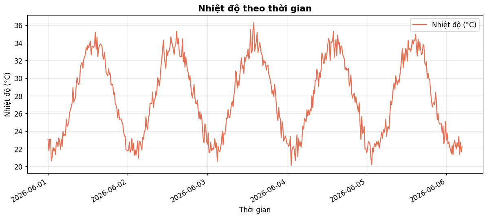
*Hình 1. Nhiệt độ theo thời gian*

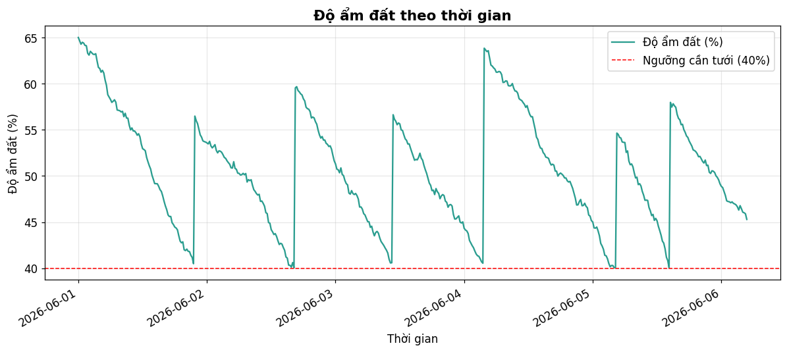
*Hình 2. Độ ẩm đất theo thời gian (đường đứt nét đỏ là ngưỡng tưới 40%)*

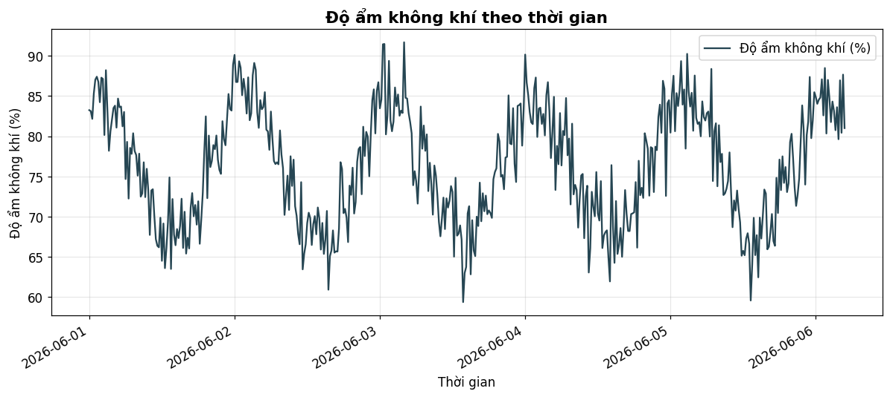
*Hình 3. Độ ẩm không khí theo thời gian*

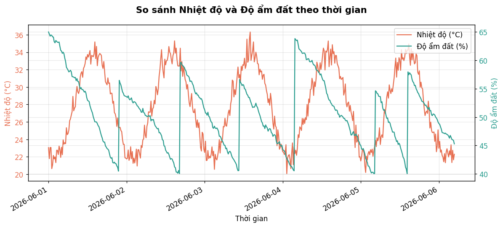
*Hình 4. So sánh Nhiệt độ và Độ ẩm đất (2 trục y)*

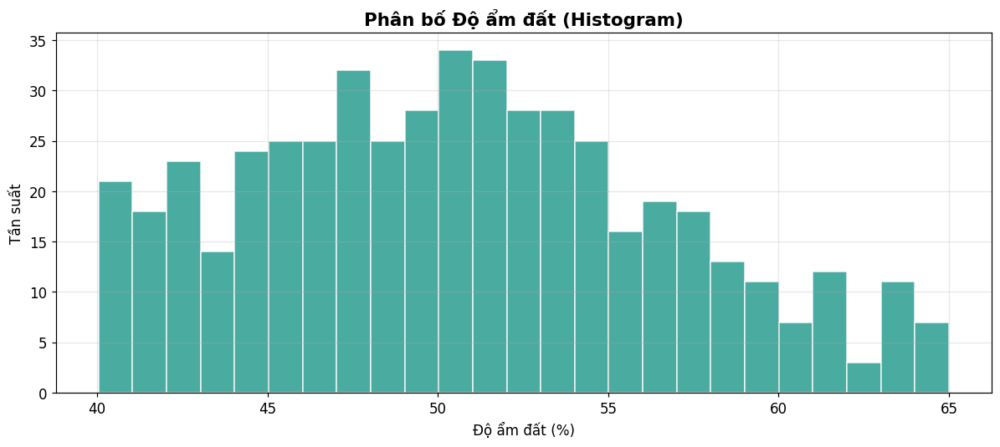
*Hình 5. Histogram phân bố Độ ẩm đất*

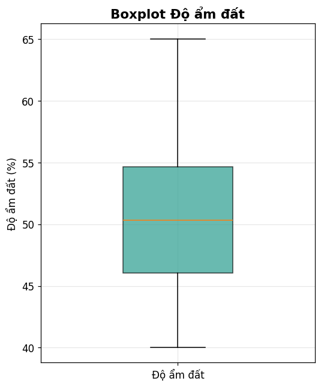
*Hình 6. Boxplot Độ ẩm đất*

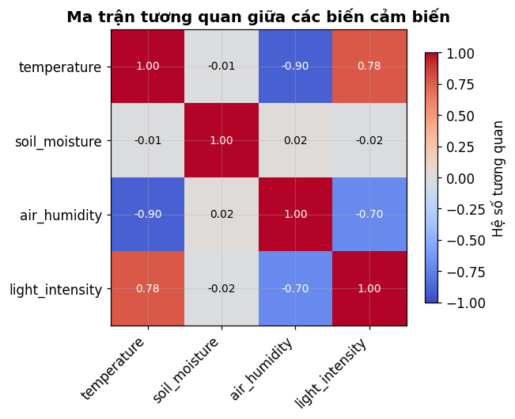
*Hình 7. Correlation Heatmap giữa các biến cảm biến*

---

## 6. Thuật toán dự báo (AI)

Nhóm lựa chọn hai kỹ thuật đơn giản, phù hợp với quy mô đồ án và dễ triển khai trên
vi điều khiển/hệ thống nhúng: **Moving Average** và **Linear Regression**, thay vì các
mô hình Deep Learning phức tạp.

### 6.1. Moving Average (Trung bình trượt)

Moving Average được sử dụng để làm mượt dữ liệu độ ẩm đất, loại bỏ nhiễu ngắn hạn và
làm nổi bật xu hướng dài hạn. Nhóm sử dụng cửa sổ trượt kích thước 8 bản ghi. Nếu giá
trị Moving Average giảm liên tục trong 6 bản ghi gần nhất, hệ thống xác định đây là
xu hướng khô hạn và phát cảnh báo sớm.

### 6.2. Linear Regression (Hồi quy tuyến tính)

Mô hình Linear Regression (scikit-learn) được huấn luyện với biến độc lập là chỉ số
thời gian (thứ tự bản ghi) và biến phụ thuộc là độ ẩm đất.

**Bảng 3. Chỉ số đánh giá mô hình Linear Regression** (kết quả chạy thực tế)

| Chỉ số | Giá trị |
|---|---|
| MAE (Sai số tuyệt đối trung bình) | 4.822 |
| RMSE (Căn bậc hai sai số bình phương trung bình) | 5.884 |
| R² (Hệ số xác định) | 0.047 |
| Hệ số góc (slope) | -0.00906 %/bản ghi |

Hệ số góc âm (-0.00906) cho thấy xu hướng độ ẩm đất giảm nhẹ theo thời gian trong giai
đoạn quan sát, phù hợp với hiện tượng bốc hơi tự nhiên khi chưa tưới. Giá trị R² thấp
(0.047) là hợp lý vì mô hình tuyến tính đơn giản không thể nắm bắt đầy đủ các dao động
phi tuyến do máy bơm gây ra — đây là mô hình baseline phù hợp cho đồ án sinh viên,
không nhằm đạt độ chính xác cao tuyệt đối mà nhằm minh họa quy trình xây dựng AI dự
báo hoàn chỉnh.

Từ mô hình đã huấn luyện, hệ thống ngoại suy (extrapolate) để ước lượng thời điểm độ
ẩm đất dự kiến giảm xuống dưới ngưỡng 40% — **thời điểm cần tưới tiếp theo dự kiến:
2026-06-15 21:00:00** (tính từ mốc dữ liệu mô phỏng kết thúc ngày 2026-06-06).

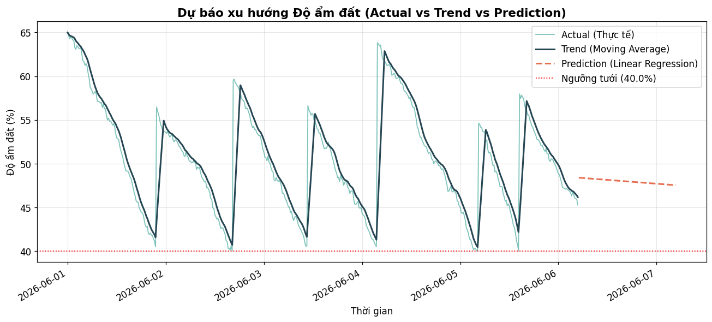
*Hình 8. Biểu đồ Actual / Trend (Moving Average) / Prediction (Linear Regression) cho Độ ẩm đất*

---

## 7. Thuật toán điều khiển

Thuật toán quyết định điều khiển máy bơm (module `src/irrigation_logic.py`) kết hợp
ngưỡng tĩnh và xu hướng động, theo các quy tắc sau:

- Nếu **Soil Moisture < 40%** → Bật bơm (`PUMP_ON`).
- Nếu **Soil Moisture > 60%** → Tắt bơm (`PUMP_OFF`).
- Nếu **40% ≤ Soil Moisture ≤ 60%** → Giữ nguyên trạng thái bơm hiện tại (vùng an toàn, `HOLD_STATE`).
- Nếu **Moving Average giảm liên tục** trong nhiều chu kỳ → Phát cảnh báo "đất sắp
  khô", kể cả khi độ ẩm hiện tại chưa xuống dưới ngưỡng.

### Lưu đồ logic quyết định tưới (Mermaid)

File nguồn: `report/diagrams/irrigation_decision_logic.mmd`

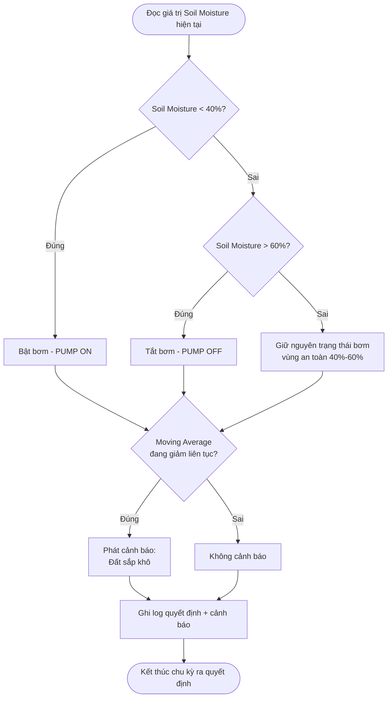

### Sơ đồ luồng tổng thể của hệ thống AI (Flowchart hệ thống)

File nguồn: `report/diagrams/system_flowchart.mmd`

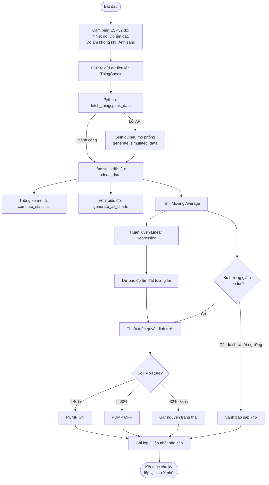

### Data Pipeline (ThingSpeak → Python → ... → Pump Control)

File nguồn: `report/diagrams/data_pipeline.mmd`

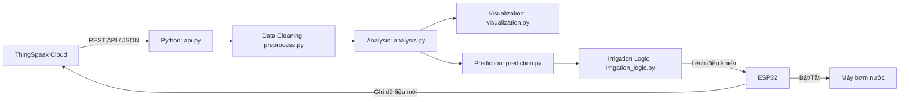

> 💡 Các khối mã Mermaid ở trên hiển thị trực quan tự động trên GitHub, GitLab, hoặc
> các trình xem Markdown hỗ trợ Mermaid (VS Code với extension Markdown Preview Mermaid
> Support, Obsidian, v.v.).

---

## 8. Kết quả

Module Phân tích dữ liệu & AI đã đạt được các kết quả cụ thể, **đã kiểm thử chạy thành
công 100% không lỗi**:

- ✅ Xây dựng hoàn chỉnh pipeline thu thập dữ liệu từ ThingSpeak API, có xử lý lỗi và
  cơ chế dự phòng bằng dữ liệu mô phỏng (đã test với credentials giả, xác nhận fallback hoạt động đúng).
- ✅ Làm sạch thành công 500 bản ghi dữ liệu, loại bỏ trùng lặp, outlier và khôi phục
  giá trị thiếu bằng nội suy.
- ✅ Tính toán đầy đủ các chỉ số thống kê mô tả và ma trận tương quan cho 4 thông số
  cảm biến chính.
- ✅ Xây dựng 8 biểu đồ trực quan (7 biểu đồ phân tích + 1 biểu đồ dự báo), có tiêu đề,
  chú thích, lưới và màu sắc rõ ràng — toàn bộ đã xuất file PNG thành công.
- ✅ Huấn luyện thành công mô hình AI dự báo kết hợp Moving Average và Linear
  Regression, ước lượng được thời điểm cần tưới tiếp theo.
- ✅ Xây dựng thuật toán quyết định điều khiển bơm tự động theo 3 mức ngưỡng, kèm cảnh
  báo sớm dựa trên xu hướng.
- ✅ Tổ chức mã nguồn thành các module rõ ràng (`api`, `preprocess`, `analysis`,
  `visualization`, `prediction`, `irrigation_logic`), có type hints và chú thích đầy
  đủ, sẵn sàng tích hợp với phần cứng ESP32 thực tế.
- ✅ Notebook `notebook/smart_irrigation_analysis.ipynb` đã được thực thi tuần tự toàn
  bộ (end-to-end) không phát sinh lỗi nào.

---

## 9. Đánh giá

### 9.1. Ưu điểm

- Pipeline đơn giản, dễ hiểu, không phụ thuộc thư viện phức tạp, phù hợp với đồ án
  sinh viên và có thể chạy trên Google Colab hoặc máy tính cá nhân.
- Có cơ chế dự phòng bằng dữ liệu mô phỏng, giúp việc phát triển và kiểm thử không bị
  phụ thuộc vào phần cứng thực tế.
- Thuật toán quyết định kết hợp cả ngưỡng tĩnh và xu hướng động, giúp hệ thống phản
  ứng linh hoạt hơn so với chỉ dùng ngưỡng đơn thuần.

### 9.2. Hạn chế

- Mô hình Linear Regression có R² thấp do bản chất phi tuyến của hiện tượng bốc hơi và
  tưới nước; mô hình chỉ phù hợp để dự báo xu hướng ngắn hạn.
- Dữ liệu mô phỏng chưa phản ánh đầy đủ các yếu tố thực tế như mưa, loại đất, loại cây
  trồng khác nhau.
- Thuật toán quyết định chưa tính đến yếu tố dự báo thời tiết (ví dụ sắp có mưa thì
  không cần tưới).

---

## 10. Hướng phát triển

- Tích hợp dữ liệu thời tiết (dự báo mưa, độ ẩm) từ API bên ngoài để tối ưu quyết định tưới.
- Thử nghiệm các mô hình chuỗi thời gian nâng cao hơn như ARIMA, Prophet hoặc mạng
  nơ-ron hồi quy (LSTM) khi có đủ dữ liệu thực tế dài hạn.
- Xây dựng dashboard trực tuyến (web app) hiển thị dữ liệu và biểu đồ theo thời gian
  thực thay vì chạy notebook thủ công.
- Bổ sung cơ chế học từ phản hồi thực tế (feedback loop) để tự động điều chỉnh ngưỡng
  tưới theo từng loại cây và điều kiện khí hậu cụ thể.
- Triển khai gửi cảnh báo qua ứng dụng di động / Telegram / email khi phát hiện xu
  hướng khô hạn bất thường.

---

*— Hết báo cáo —*
